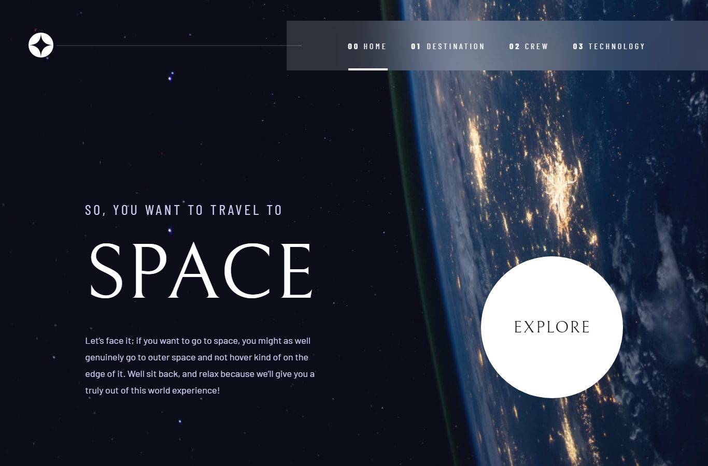

# Frontend Mentor - Space tourism website solution

This is a solution to the [Space tourism website challenge on Frontend Mentor](https://www.frontendmentor.io/challenges/space-tourism-multipage-website-gRWj1URZ3). Frontend Mentor challenges help you improve your coding skills by building realistic projects. 

## Table of contents

- [Overview](#overview)
  - [The challenge](#the-challenge)
  - [Screenshot](#screenshot)
  - [Links](#links)
- [My process](#my-process)
  - [Built with](#built-with)
  - [What I learned](#what-i-learned)
  - [Continued development](#continued-development)
- [Author](#author)

### The challenge

Users should be able to:

- View the optimal layout for the site depending on their device's screen size
- See hover states for all interactive elements on the page

### Screenshot

### Links

Live Site URL: [Live site of the challenge](https://frontendmentor-space-tourism.vercel.app/)

## My process

Hello, this is my 23rd challenge from frontendmentor^^. it's been a long time since I submitted a new solution so it is kind of refreshing to make one again^^.

For this one, I used next.js since it makes handling multi pages easier. 
 1. I used react-context to store data at first I want to use initialprops but then again, if I would to use it, I would need to create a store as well or props-drilling which I don't like.
 2. Changed. I removed the context and used getStaticProps so that it will serve now the data instead of treating it as SPA.

I used a custom link for the api since I don't know how to fetch local .json file in react :>>.

What challenge me here is the animation since I am new to framer-motion and my schedule is really hectic since I have loads of school activs but finished them so i am glad, got my laptop formatted as well.

Overall, I am please on this but could have used more animations, like space-y animations right. Thank you reading this, hope you have great day^^

### Built with

- Semantic HTML5 markup
- FlexBox
- Grid
- Sass 
- React
- Next.js
- Framer-motion

### What I learned

I learned on this challenge to implement some things from framer-motion in react. I am new to using framer-motion to be honest so I don't know  if I used it properly but hey, it works it works especially when just starting out right.

I also learned how to use figma:>> I am really new to figma, first time to use it on this challenge since it have the design which is really nice yey. I am using adobe xd always so it confuses me a bit to use figma. Recently, I just figured out that I could resize figma to see my windows taskbar hahaha, I feel ashamed a bit.

### Continued development

I will always continue to learn about next.js and creating different own projects with. Currently I have a ready made design for a big project of mine, hopefull I would be able to implement it properly and deploy^^

## Author

- Website - Well I haven't made my profile portfolio, gonna make it sooon when I know a lot of stuffs
- Frontend Mentor - [@pikamart](https://www.frontendmentor.io/profile/pikamart)
- Twitter - [@RaymartPamplona](https://twitter.com/RaymartPamplona)
